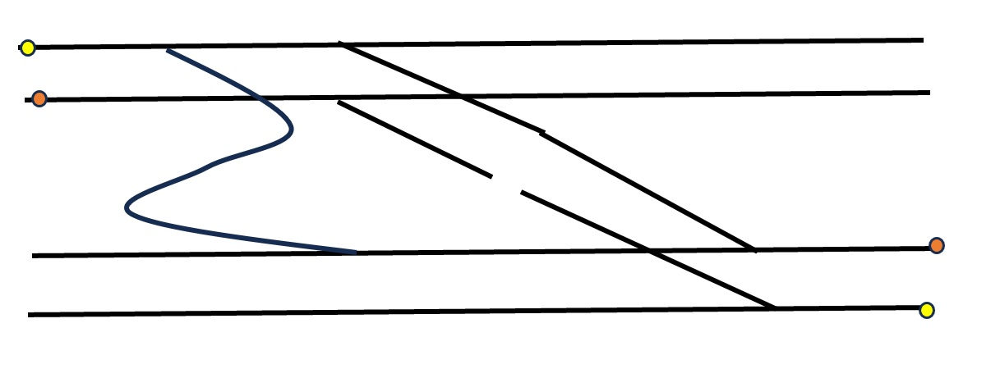
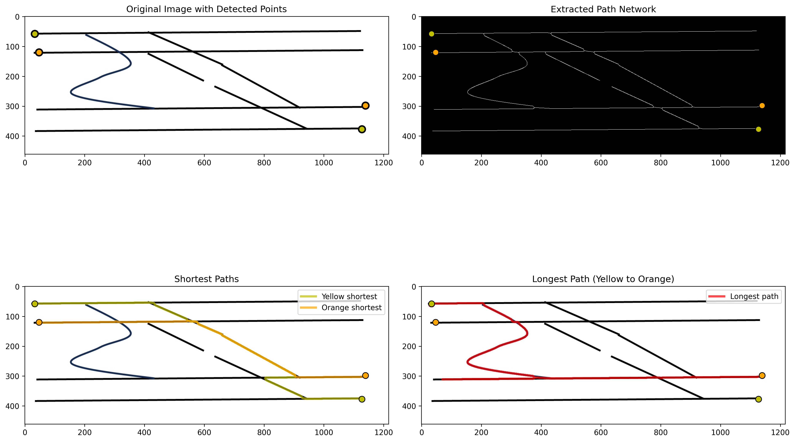

# Path Analyzer 🧭

This project detects paths between colored points in an image using graph-based pathfinding algorithms (like BFS). It helps visualize shortest paths between specific start and end points based on pixel-level analysis.

---

## 🖼️ Input Example

| Input Image |
|-------------|
|  |

- Yellow and orange dots represent start/end points
- Black paths connect them across the image

---

## ✅ Output Example

| Output Image |
|--------------|
|  |

- Shortest path between points is highlighted
- Nodes are connected using BFS traversal

---

## 🚀 How it Works

1. **Detects colored points** (yellow/orange) as start and end nodes
2. **Skeletonizes the path network** to reduce to 1-pixel width
3. **Constructs a graph** from connected path pixels
4. **Applies BFS** to find the shortest path
5. **Draws the result** onto the image

---

## 🧪 Usage

```bash
# Clone the repo
git clone https://github.com/your-username/path-analyzer.git
cd path-analyzer

# Install dependencies
pip install -r requirements.txt

# Run the analyzer
python path_analyzer.py --input input_images/sample_input.png --output output_images/sample_output.png
